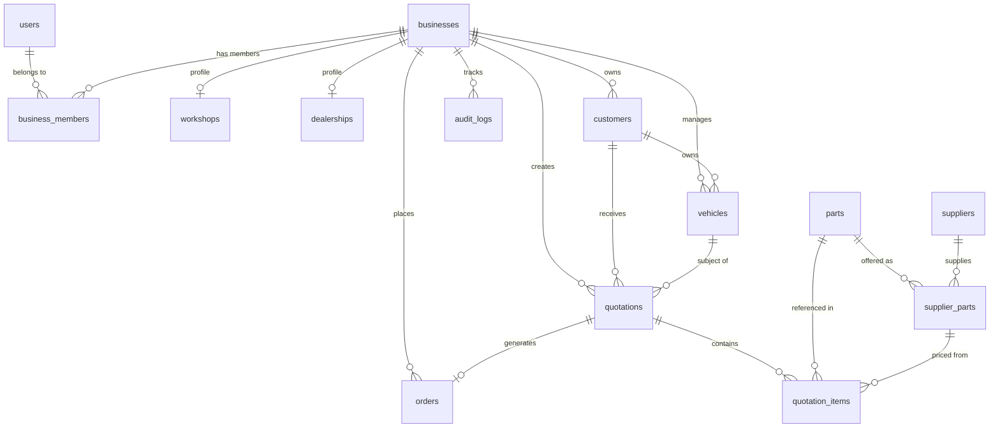

# DrivePlugAutoSA - Database Design & Schema Specification

**Document Version:** 1.0.0  
**Database Engine:** PostgreSQL 15+ (Hosted on Supabase)  
**Primary Key Convention:** UUID v4 (`gen_random_uuid()`)  
**Timestamp Convention:** `timestamptz` with default `now()`  

---

## 1. Global vs. Tenant-Owned Tables

Understanding data ownership is paramount to implementing airtight tenant isolation:

| Classification | Tables | Ownership Model & Access Rules |
| :--- | :--- | :--- |
| **Global / Shared Reference** | `suppliers`, `parts`, `supplier_parts` | Maintained centrally by DrivePlugAutoSA platform administrators or ingested via automated supplier catalog feeds. Accessible for read/search by all authenticated workshops/dealerships. |
| **Global Identity & Platform** | `users`, `businesses`, `business_members` | System-level entities managing authentication identity, business tenants, and membership mappings. |
| **Tenant-Owned (Workshops / Dealerships)** | `workshops`, `dealerships`, `customers`, `vehicles`, `quotations`, `quotation_items`, `orders`, `audit_logs` | Owned strictly by a single `business_id`. Strictly partitioned using PostgreSQL Row Level Security (RLS). A user associated with Business A can never query, insert, update, or delete records belonging to Business B. |

---

## 2. Entity-Relationship Diagram (ERD)

---

## 3. Normalized Schema Definitions

### 3.1. `users` (Identity Profiles)
Maps to `auth.users` managed by Supabase Authentication.
- `id` (`UUID`, PK, `REFERENCES auth.users(id) ON DELETE CASCADE`)
- `email` (`VARCHAR(255)`, UNIQUE, NOT NULL)
- `full_name` (`VARCHAR(150)`, NOT NULL)
- `phone` (`VARCHAR(30)`)
- `avatar_url` (`TEXT`)
- `created_at` (`TIMESTAMPTZ`, DEFAULT `now()`, NOT NULL)
- `updated_at` (`TIMESTAMPTZ`, DEFAULT `now()`, NOT NULL)

### 3.2. `businesses` (Tenants)
Top-level multi-tenant container for independent workshops or dealership groups.
- `id` (`UUID`, PK, DEFAULT `gen_random_uuid()`)
- `name` (`VARCHAR(150)`, NOT NULL)
- `slug` (`VARCHAR(100)`, UNIQUE, NOT NULL)
- `type` (`VARCHAR(30)`, NOT NULL, CHECK `type IN ('WORKSHOP', 'DEALERSHIP', 'FLEET')`)
- `tax_number` (`VARCHAR(50)`)
- `email` (`VARCHAR(255)`, NOT NULL)
- `phone` (`VARCHAR(30)`)
- `currency` (`VARCHAR(3)`, DEFAULT `'ZAR'`, NOT NULL)
- `address` (`JSONB`, DEFAULT `'{}'::jsonb`)
- `created_at` (`TIMESTAMPTZ`, DEFAULT `now()`, NOT NULL)
- `updated_at` (`TIMESTAMPTZ`, DEFAULT `now()`, NOT NULL)

### 3.3. `business_members` (Tenant Memberships & Roles)
Junction table linking users to businesses with role-based access control.
- `id` (`UUID`, PK, DEFAULT `gen_random_uuid()`)
- `business_id` (`UUID`, NOT NULL, `REFERENCES businesses(id) ON DELETE CASCADE`)
- `user_id` (`UUID`, NOT NULL, `REFERENCES users(id) ON DELETE CASCADE`)
- `role` (`VARCHAR(20)`, NOT NULL, CHECK `role IN ('OWNER', 'ADMIN', 'MANAGER', 'STAFF')`)
- `is_active` (`BOOLEAN`, DEFAULT `true`, NOT NULL)
- `created_at` (`TIMESTAMPTZ`, DEFAULT `now()`, NOT NULL)
- `updated_at` (`TIMESTAMPTZ`, DEFAULT `now()`, NOT NULL)
- **Constraints & Indexes:** `UNIQUE(business_id, user_id)`, `INDEX(user_id)`, `INDEX(business_id)`.

### 3.4. `workshops` (Workshop Profile & Rates)
Operational parameters for repair facilities.
- `id` (`UUID`, PK, DEFAULT `gen_random_uuid()`)
- `business_id` (`UUID`, UNIQUE, NOT NULL, `REFERENCES businesses(id) ON DELETE CASCADE`)
- `hourly_labor_rate` (`DECIMAL(10,2)`, DEFAULT `650.00`, NOT NULL, CHECK `hourly_labor_rate >= 0`)
- `default_parts_markup_pct` (`DECIMAL(5,2)`, DEFAULT `25.00`, NOT NULL, CHECK `default_parts_markup_pct >= 0`)
- `bay_count` (`INTEGER`, DEFAULT `4`, CHECK `bay_count > 0`)
- `created_at` (`TIMESTAMPTZ`, DEFAULT `now()`, NOT NULL)
- `updated_at` (`TIMESTAMPTZ`, DEFAULT `now()`, NOT NULL)

### 3.5. `dealerships` (Dealership Profile)
Franchise dealer department specifications.
- `id` (`UUID`, PK, DEFAULT `gen_random_uuid()`)
- `business_id` (`UUID`, UNIQUE, NOT NULL, `REFERENCES businesses(id) ON DELETE CASCADE`)
- `brand_franchises` (`TEXT[]`, DEFAULT `'{}'::text[]`)
- `dealer_code` (`VARCHAR(50)`)
- `created_at` (`TIMESTAMPTZ`, DEFAULT `now()`, NOT NULL)
- `updated_at` (`TIMESTAMPTZ`, DEFAULT `now()`, NOT NULL)

### 3.6. `customers` (Tenant-Owned Customer Directory)
- `id` (`UUID`, PK, DEFAULT `gen_random_uuid()`)
- `business_id` (`UUID`, NOT NULL, `REFERENCES businesses(id) ON DELETE CASCADE`)
- `first_name` (`VARCHAR(100)`, NOT NULL)
- `last_name` (`VARCHAR(100)`, NOT NULL)
- `email` (`VARCHAR(255)`)
- `phone` (`VARCHAR(30)`, NOT NULL)
- `id_number` (`VARCHAR(50)`)
- `address` (`TEXT`)
- `created_at` (`TIMESTAMPTZ`, DEFAULT `now()`, NOT NULL)
- `updated_at` (`TIMESTAMPTZ`, DEFAULT `now()`, NOT NULL)
- **Indexes:** `INDEX(business_id)`, `INDEX(business_id, phone)`, `INDEX(business_id, email)`.

### 3.7. `vehicles` (Tenant-Owned Vehicle Registry)
- `id` (`UUID`, PK, DEFAULT `gen_random_uuid()`)
- `business_id` (`UUID`, NOT NULL, `REFERENCES businesses(id) ON DELETE CASCADE`)
- `customer_id` (`UUID`, NOT NULL, `REFERENCES customers(id) ON DELETE RESTRICT`)
- `vin` (`VARCHAR(17)`, NOT NULL)
- `license_plate` (`VARCHAR(20)`, NOT NULL)
- `make` (`VARCHAR(50)`, NOT NULL)
- `model` (`VARCHAR(50)`, NOT NULL)
- `year` (`INTEGER`, NOT NULL, CHECK `year BETWEEN 1950 AND 2050`)
- `mileage` (`INTEGER`, DEFAULT `0`, CHECK `mileage >= 0`)
- `engine_code` (`VARCHAR(50)`)
- `transmission` (`VARCHAR(20)`)
- `created_at` (`TIMESTAMPTZ`, DEFAULT `now()`, NOT NULL)
- `updated_at` (`TIMESTAMPTZ`, DEFAULT `now()`, NOT NULL)
- **Indexes:** `INDEX(business_id)`, `INDEX(business_id, vin)`, `INDEX(business_id, license_plate)`, `INDEX(customer_id)`.

### 3.8. `suppliers` (Global Parts Wholesalers)
- `id` (`UUID`, PK, DEFAULT `gen_random_uuid()`)
- `name` (`VARCHAR(150)`, NOT NULL)
- `code` (`VARCHAR(50)`, UNIQUE, NOT NULL)
- `contact_email` (`VARCHAR(255)`, NOT NULL)
- `phone` (`VARCHAR(30)`)
- `lead_time_rating` (`DECIMAL(3,2)`, DEFAULT `4.5`)
- `api_adapter` (`VARCHAR(50)`, DEFAULT `'MOCK_DISTRIBUTOR'`)
- `is_active` (`BOOLEAN`, DEFAULT `true`, NOT NULL)
- `created_at` (`TIMESTAMPTZ`, DEFAULT `now()`, NOT NULL)
- `updated_at` (`TIMESTAMPTZ`, DEFAULT `now()`, NOT NULL)

### 3.9. `parts` (Master Automotive Parts Catalogue)
- `id` (`UUID`, PK, DEFAULT `gen_random_uuid()`)
- `part_number` (`VARCHAR(100)`, NOT NULL)
- `name` (`VARCHAR(200)`, NOT NULL)
- `category` (`VARCHAR(100)`, NOT NULL)
- `description` (`TEXT`)
- `oem_reference` (`VARCHAR(100)`)
- `is_oem` (`BOOLEAN`, DEFAULT `false`, NOT NULL)
- `created_at` (`TIMESTAMPTZ`, DEFAULT `now()`, NOT NULL)
- `updated_at` (`TIMESTAMPTZ`, DEFAULT `now()`, NOT NULL)
- **Indexes:** `INDEX(part_number)`, `INDEX(category)`, `INDEX(oem_reference)`.

### 3.10. `supplier_parts` (Wholesale Price & Inventory Feeds)
- `id` (`UUID`, PK, DEFAULT `gen_random_uuid()`)
- `supplier_id` (`UUID`, NOT NULL, `REFERENCES suppliers(id) ON DELETE CASCADE`)
- `part_id` (`UUID`, NOT NULL, `REFERENCES parts(id) ON DELETE CASCADE`)
- `supplier_sku` (`VARCHAR(100)`, NOT NULL)
- `cost_price` (`DECIMAL(10,2)`, NOT NULL, CHECK `cost_price >= 0`)
- `currency` (`VARCHAR(3)`, DEFAULT `'ZAR'`, NOT NULL)
- `stock_quantity` (`INTEGER`, DEFAULT `0`, NOT NULL, CHECK `stock_quantity >= 0`)
- `availability` (`VARCHAR(30)`, NOT NULL, CHECK `availability IN ('IN_STOCK', 'LOW_STOCK', 'ORDER_ON_DEMAND', 'OUT_OF_STOCK')`)
- `lead_time_days` (`INTEGER`, DEFAULT `1`, NOT NULL, CHECK `lead_time_days >= 0`)
- `last_updated_at` (`TIMESTAMPTZ`, DEFAULT `now()`, NOT NULL)
- **Constraints & Indexes:** `UNIQUE(supplier_id, part_id)`, `INDEX(part_id, cost_price)`, `INDEX(supplier_id)`.

### 3.11. `quotations` (Tenant-Owned Quotations)
- `id` (`UUID`, PK, DEFAULT `gen_random_uuid()`)
- `business_id` (`UUID`, NOT NULL, `REFERENCES businesses(id) ON DELETE CASCADE`)
- `quotation_number` (`VARCHAR(50)`, NOT NULL)
- `customer_id` (`UUID`, NOT NULL, `REFERENCES customers(id) ON DELETE RESTRICT`)
- `vehicle_id` (`UUID`, NOT NULL, `REFERENCES vehicles(id) ON DELETE RESTRICT`)
- `status` (`VARCHAR(20)`, NOT NULL, DEFAULT `'DRAFT'`, CHECK `status IN ('DRAFT', 'SENT', 'APPROVED', 'REJECTED', 'EXPIRED')`)
- `parts_subtotal` (`DECIMAL(10,2)`, DEFAULT `0.00`, NOT NULL)
- `labor_subtotal` (`DECIMAL(10,2)`, DEFAULT `0.00`, NOT NULL)
- `tax_rate` (`DECIMAL(5,2)`, DEFAULT `15.00`, NOT NULL)
- `tax_amount` (`DECIMAL(10,2)`, DEFAULT `0.00`, NOT NULL)
- `discount_amount` (`DECIMAL(10,2)`, DEFAULT `0.00`, NOT NULL)
- `grand_total` (`DECIMAL(10,2)`, DEFAULT `0.00`, NOT NULL)
- `notes` (`TEXT`)
- `valid_until` (`TIMESTAMPTZ`, NOT NULL)
- `sent_at` (`TIMESTAMPTZ`)
- `approved_at` (`TIMESTAMPTZ`)
- `rejected_at` (`TIMESTAMPTZ`)
- `created_by` (`UUID`, `REFERENCES users(id) ON DELETE SET NULL`)
- `created_at` (`TIMESTAMPTZ`, DEFAULT `now()`, NOT NULL)
- `updated_at` (`TIMESTAMPTZ`, DEFAULT `now()`, NOT NULL)
- **Indexes:** `UNIQUE(business_id, quotation_number)`, `INDEX(business_id, status)`, `INDEX(customer_id)`, `INDEX(vehicle_id)`.

### 3.12. `quotation_items` (Quotation Line Items)
- `id` (`UUID`, PK, DEFAULT `gen_random_uuid()`)
- `quotation_id` (`UUID`, NOT NULL, `REFERENCES quotations(id) ON DELETE CASCADE`)
- `part_id` (`UUID`, `REFERENCES parts(id) ON DELETE SET NULL`)
- `supplier_part_id` (`UUID`, `REFERENCES supplier_parts(id) ON DELETE SET NULL`)
- `item_type` (`VARCHAR(20)`, NOT NULL, CHECK `item_type IN ('PART', 'LABOR', 'MISC')`)
- `description` (`VARCHAR(255)`, NOT NULL)
- `quantity` (`DECIMAL(8,2)`, NOT NULL, CHECK `quantity > 0`)
- `unit_cost` (`DECIMAL(10,2)`, DEFAULT `0.00`, NOT NULL)
- `markup_pct` (`DECIMAL(5,2)`, DEFAULT `0.00`, NOT NULL)
- `unit_price` (`DECIMAL(10,2)`, NOT NULL, CHECK `unit_price >= 0`)
- `labor_hours` (`DECIMAL(5,2)`, DEFAULT `0.00`)
- `labor_rate` (`DECIMAL(10,2)`, DEFAULT `0.00`)
- `line_total` (`DECIMAL(10,2)`, NOT NULL, CHECK `line_total >= 0`)
- `created_at` (`TIMESTAMPTZ`, DEFAULT `now()`, NOT NULL)
- **Indexes:** `INDEX(quotation_id)`.

### 3.13. `orders` (Procurement & Service Fulfillment Orders)
- `id` (`UUID`, PK, DEFAULT `gen_random_uuid()`)
- `business_id` (`UUID`, NOT NULL, `REFERENCES businesses(id) ON DELETE CASCADE`)
- `quotation_id` (`UUID`, UNIQUE, NOT NULL, `REFERENCES quotations(id) ON DELETE RESTRICT`)
- `order_number` (`VARCHAR(50)`, NOT NULL)
- `status` (`VARCHAR(20)`, NOT NULL, DEFAULT `'PENDING'`, CHECK `status IN ('PENDING', 'CONFIRMED', 'PARTS_ORDERED', 'IN_PROGRESS', 'FULFILLED', 'CANCELLED')`)
- `total_amount` (`DECIMAL(10,2)`, NOT NULL)
- `placed_at` (`TIMESTAMPTZ`, DEFAULT `now()`, NOT NULL)
- `fulfilled_at` (`TIMESTAMPTZ`)
- `created_at` (`TIMESTAMPTZ`, DEFAULT `now()`, NOT NULL)
- `updated_at` (`TIMESTAMPTZ`, DEFAULT `now()`, NOT NULL)
- **Indexes:** `UNIQUE(business_id, order_number)`, `INDEX(business_id, status)`.

### 3.14. `audit_logs` (Tenant Audit Trail)
- `id` (`UUID`, PK, DEFAULT `gen_random_uuid()`)
- `business_id` (`UUID`, NOT NULL, `REFERENCES businesses(id) ON DELETE CASCADE`)
- `user_id` (`UUID`, `REFERENCES users(id) ON DELETE SET NULL`)
- `action` (`VARCHAR(50)`, NOT NULL)
- `entity_type` (`VARCHAR(50)`, NOT NULL)
- `entity_id` (`UUID`, NOT NULL)
- `old_values` (`JSONB`)
- `new_values` (`JSONB`)
- `ip_address` (`VARCHAR(45)`)
- `created_at` (`TIMESTAMPTZ`, DEFAULT `now()`, NOT NULL)
- **Indexes:** `INDEX(business_id, entity_type, entity_id)`, `INDEX(business_id, created_at)`.
