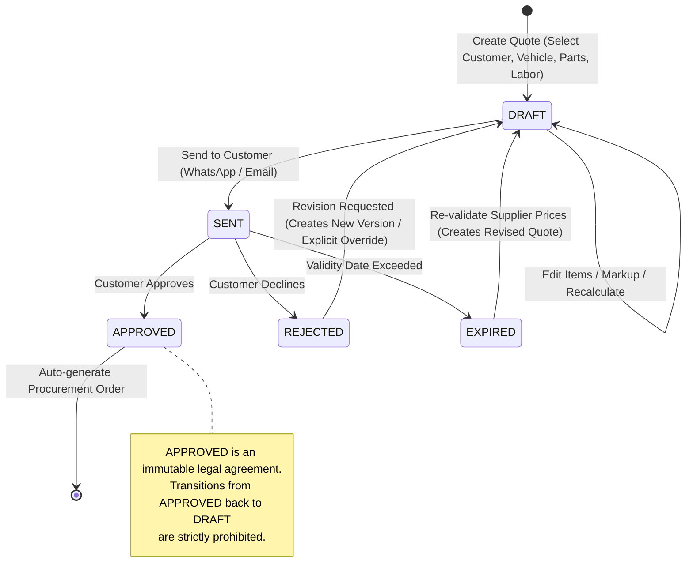

# DrivePlugAutoSA - Core Quotation Workflow & State Machine

**Document Version:** 1.0.0  
**Domain Module:** `quotations`  
**State Machine Engine:** Deterministic Domain Finite State Machine (FSM)  

---

## 1. Quotation Lifecycle & State Machine

The quotation lifecycle represents the financial and operational contract between the workshop and the customer. State transitions are strictly controlled by the domain service layer.

---

## 2. Transition Matrix & Rules

| Current Status | Target Status | Permitted? | Condition & Side-Effects |
| :--- | :--- | :---: | :--- |
| `DRAFT` | `SENT` | **YES** | Requires at least 1 line item, valid customer contact (email/phone), and `valid_until > now()`. Dispatches customer notification adapter. Sets `sent_at = now()`. |
| `SENT` | `APPROVED` | **YES** | Customer accepts via link or workshop logs approval. Sets `approved_at = now()`. Triggers automatic creation of linked `orders` record. |
| `SENT` | `REJECTED` | **YES** | Customer declines with optional reason code (e.g. "Too Expensive", "Sold Vehicle"). Sets `rejected_at = now()`. |
| `SENT` | `EXPIRED` | **YES** | Automatically marked when `now() > valid_until` or triggered by cron check. |
| `APPROVED` | `DRAFT` | **PROHIBITED** | **Strictly Forbidden:** Changing an approved quotation would alter legally agreed financial terms, invalidate supplier procurement orders, and break accounting audits. |
| `REJECTED` | `DRAFT` | **CONDITIONAL** | Only via explicit "Revise & Resubmit" action, which creates a copy or logs an audit event before clearing rejection. |
| `APPROVED` | `REJECTED` | **PROHIBITED** | Requires formal cancellation of the downstream order. |

---

## 3. Financial Calculation Engine & Formulas

All calculations use fixed-precision decimal arithmetic (2 decimal places) to prevent IEEE 754 floating-point rounding errors.

### 3.1. Line Item Formulas
For Part Items:
$$\text{Unit Price} = \text{Unit Cost} \times \left(1 + \frac{\text{Markup \%}}{100}\right)$$
$$\text{Line Total}_{\text{Part}} = \text{Quantity} \times \text{Unit Price}$$

For Labor Items:
$$\text{Line Total}_{\text{Labor}} = \text{Labor Hours} \times \text{Hourly Labor Rate}$$

### 3.2. Quotation Aggregate Formulas
$$\text{Parts Subtotal} = \sum \text{Line Total}_{\text{Part}}$$
$$\text{Labor Subtotal} = \sum \text{Line Total}_{\text{Labor}}$$
$$\text{Net Subtotal} = \text{Parts Subtotal} + \text{Labor Subtotal} - \text{Discount Amount}$$
$$\text{Tax Amount (VAT 15\%)} = \text{Net Subtotal} \times \frac{\text{Tax Rate}}{100}$$
$$\text{Grand Total} = \text{Net Subtotal} + \text{Tax Amount}$$

### 3.3. Deterministic Invariants
1. Line totals can never be negative.
2. Markup percentage defaults to workshop standard (e.g. 25%) but can be overridden per line item with role `MANAGER` or higher.
3. Tax rate defaults to South African standard VAT (15.00%) or tenant config.

---

## 4. Automatic Order Generation

Upon transitioning to `APPROVED`, the domain event `QuoteApprovedEvent` invokes `OrderService.createFromQuotation(quotationId)`:
1. Generates sequential `order_number` (e.g. `ORD-2026-0089`).
2. Reserves wholesale supplier parts pricing based on selected `supplier_part_id`.
3. Sets initial order status to `PENDING`.
4. Emits `OrderCreatedEvent` for supplier dispatch notification.
