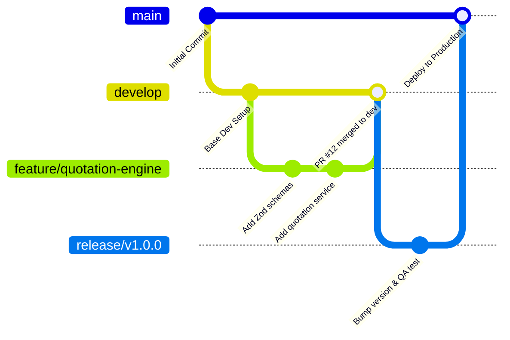

# DrivePlugAutoSA - DevOps, CI/CD & Deployment Strategy

**Document Version:** 1.0.0  
**Cloud Hosting:** Vercel (Edge & Serverless Next.js), Supabase Cloud (Managed PostgreSQL)  
**CI/CD Engine:** GitHub Actions  

---

## 1. Multi-Tier Environment Strategy

| Environment | Purpose | Infrastructure | Database | Domain / URL |
| :--- | :--- | :--- | :--- | :--- |
| **Local (`dev`)** | Feature development & automated testing | Local Node.js / Next.js dev server (`localhost:3000`) | Local Docker Supabase or In-Memory Mock Repository | `http://localhost:3000` |
| **Staging (`preview`)** | Integration testing, PR previews, QA & partner demos | Vercel Preview Deployments (auto-generated per PR) | Supabase Staging Project / Database Branch | `https://preview-*.driveplugauto.app` |
| **Production (`prod`)** | Live commercial operations for pilot workshops | Vercel Global Edge Network (High Availability) | Supabase Cloud Production (Multi-AZ with PITR) | `https://app.driveplugauto.co.za` |

---

## 2. Git Branching & Collaboration Workflow



1. **Branch Naming:**
   - `feature/<ticket-id>-<slug>` (e.g. `feature/DP-104-supplier-price-matrix`)
   - `fix/<ticket-id>-<slug>`
   - `chore/<slug>`
2. **Pull Request Rules:**
   - At least 1 peer approval required.
   - All CI checks (lint, typecheck, tests, build) must be green.
   - No direct pushes to `main` or `develop`.

---

## 3. GitHub Actions CI Pipeline

File: `.github/workflows/ci.yml`
```yaml
name: Continuous Integration

on:
  push:
    branches: [main, develop]
  pull_request:
    branches: [main, develop]

jobs:
  validate:
    runs-on: ubuntu-latest
    steps:
      - name: Checkout Source Code
        uses: actions/checkout@v4

      - name: Setup Node.js Environment
        uses: actions/setup-node@v4
        with:
          node-version: 18.x
          cache: 'npm'

      - name: Install Dependencies
        run: npm ci

      - name: Static Type Checking
        run: npx tsc --noEmit

      - name: Run Automated Test Suite
        run: npm test

      - name: Next.js Production Build
        env:
          NEXT_PUBLIC_SUPABASE_URL: ${{ secrets.NEXT_PUBLIC_SUPABASE_URL }}
          NEXT_PUBLIC_SUPABASE_ANON_KEY: ${{ secrets.NEXT_PUBLIC_SUPABASE_ANON_KEY }}
        run: npm run build
```

---

## 4. Database Migrations & Versioning

Database changes are managed as forward-only SQL migration files in `supabase/migrations/`:
1. Migration files follow timestamps: `YYYYMMDD_HHMMSS_<description>.sql`.
2. Migrations are applied in CI/CD using Supabase CLI:
   ```bash
   supabase db push --db-url "$DATABASE_URL"
   ```
3. Destructive operations (dropping columns or tables) are strictly prohibited in single-step deployments. We follow the **Expand and Contract pattern**:
   - Step 1: Add new column as nullable.
   - Step 2: Update application code to dual-write.
   - Step 3: Backfill data.
   - Step 4: Drop old column in a subsequent release.

---

## 5. Backup & Disaster Recovery

- **Point-In-Time Recovery (PITR):** Production Supabase PostgreSQL utilizes Write-Ahead Log (WAL) archiving enabling restoration to any second within the past 7 days.
- **Daily Physical Backups:** Automated daily snapshots retained for 30 days.
- **RTO (Recovery Time Objective):** $< 30$ minutes.
- **RPO (Recovery Point Objective):** $< 1$ minute.

---

## 6. Observability, Logging & Error Tracking

- **Application Performance Monitoring (APM):** Vercel Analytics for Core Web Vitals, serverless execution latency, and edge hit rates.
- **Error Tracking:** Sentry Next.js SDK captures unhandled exceptions with full stack traces, breadcrumbs, and anonymized tenant context.
- **Health Check Endpoint:** `GET /api/health` performs a lightweight ping to Supabase PostgreSQL and returns system status.
